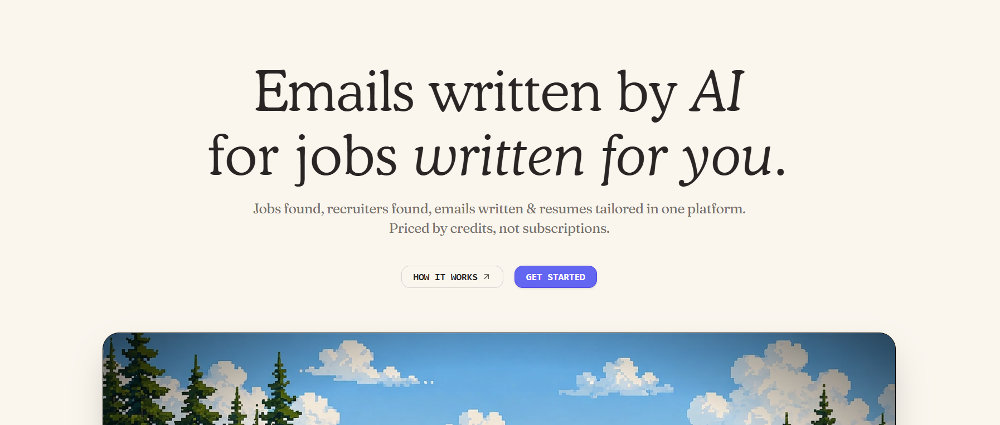

  

# FetchrLy — AI Cold Email Agent, Smart Follow-Up Sequences & ATS Resume Tailoring

**Live platform:** [fetchrly.co.in](https://fetchrly.co.in/)

---

## Contents

- [Overview](#overview)
- [System Architecture](#system-architecture)
- [Core Workflow](#core-workflow)
- [Features](#features)
- [Automated Follow-Up Logic](#automated-follow-up-logic)
- [Technology Stack](#technology-stack)
- [Security & Privacy](#security--privacy)
- [Infrastructure](#infrastructure)
- [Links](#links)
- [Legal](#legal)

---

## Overview

FetchrLy is an end-to-end AI career outreach platform. It helps candidates discover verified hiring managers, tailor resumes to a target job description without disrupting layout, generate personalized cold emails, and run automated follow-up sequences — all dispatched through the candidate's own Gmail account.

---

## System Architecture

  

---

## Core Workflow

  

---

## Features

| Feature | Summary |
|---|---|
| Smart Follow-Up Sequences | Automated 3-step cadence (Day 0, Day 3–4, Day 7–8) with read-based branching. 2 credits per sequence; cancels in one click. See [Automated Follow-Up Logic](#automated-follow-up-logic). |
| ATS Resume Tailoring | Aligns resumes to a target job description using PyMuPDF and python-docx, inserting keywords and metrics without altering layout. Side-by-side original vs. tailored preview. |
| Recruiter Discovery | DNS MX resolution and SMTP handshake verification with confidence tiers (verified / medium / unverified) and 94%+ inbox placement. Credit refund if no recruiter is found. |
| Authenticity Meter | Client-side NLP scoring (0–100) flags generic AI phrasing, with one-click rewrite into more natural language. |
| Live Job Search | Adzuna API integration across 20+ countries with role, location, and remote filters. |
| Native Gmail Delivery | Sends through the candidate's own Gmail account via OAuth 2.0, with no third-party sender headers. |
| Open Tracking | Invisible pixel tracking with bot filtering and real-time open alerts via Brevo. |
| Global Localization | Pricing and checkout adapt to local currency across 240+ countries via IP/header geolocation. |
| LLM Gateway | Multi-provider fallback across Gemini, Groq, and NVIDIA NIM, with encrypted BYOK support and machine-readable manifests (`/llms.txt`, `/.well-known/ai-plugin.json`). |

---

## Automated Follow-Up Logic

  

Follow-up drafts inherit the resume version (original or tailored) used in the initial outreach. Cancelled sequences retain their planned drafts for auditability.

---

## Technology Stack

| Layer | Technology | Purpose |
|---|---|---|
| Frontend Framework | React 19.2, TypeScript 5.8, Vite 8 | Type-safe single-page application |
| Routing | TanStack Router v1.170 | File-based, type-safe client-side routing |
| Data Fetching & Cache | TanStack Query v5.101 | Server-state caching and background refetching |
| Styling & UI | Tailwind CSS 4, Radix UI, Lucide Icons | Dark/light UI system |
| Animation & Data Vis | Framer Motion, Motion 13, Recharts, Dotted Map | Dashboards and interactive simulators |
| Backend Framework | Python 3.11+, FastAPI 0.115, Uvicorn, Gunicorn | Async REST API |
| Database & ORM | PostgreSQL / SQLite, SQLAlchemy 2.0 | Relational storage with startup migrations |
| Caching & Rate Limiting | Redis 5.0+ | Rate limiting, OTP sessions, query caching |
| Cloud File Storage | Supabase Storage | Resume persistence with per-user space recycling |
| Document Processing | PyMuPDF, python-docx, pdfplumber, pdf2docx | PDF/DOCX text extraction and synthesis |
| Email Discovery | dnspython, SMTP sockets, Abstract API | DNS MX lookup and SMTP handshake checks |
| LLM Inference | Google GenAI SDK, Groq SDK, NVIDIA NIM | Multi-provider generation pipeline |
| Mail Delivery & Tracking | Gmail API, Google Auth OAuthlib | Authenticated personal inbox dispatch |
| Transactional Alerts | Brevo API | OTPs, resets, and open-alert notifications |
| Payments | Dodo Payments, Razorpay | Multi-currency checkout with webhook verification |
| Deployment | Vercel (frontend), Render (backend) | Production hosting with SSL and CI/CD |

---

## Security & Privacy

| Aspect | Detail |
|---|---|
| OAuth & Tokens | Scoped Google OAuth 2.0 for Gmail dispatch; refresh tokens encrypted at rest with Fernet AES-256 |
| BYOK Encryption | User-supplied LLM API keys (Gemini, Groq, NVIDIA) encrypted client-to-server and stored with AES-256 |
| Resume Storage | Supabase Storage with restricted per-user buckets and automated cleanup on request or profile reset |
| Email Headers | Dispatched directly via the candidate's Gmail account — no third-party sender headers or telemetry |
| Compliance | GDPR-aligned data minimization; candidate data is never sold or used to train third-party models |

---

## Infrastructure

| Component | Platform | Notes |
|---|---|---|
| Backend | Render | Python 3.11, Gunicorn + Uvicorn workers, automatic SSL, health monitoring |
| Frontend | Vercel Edge Network | Global edge caching for static assets and SPA routing |
| Data | PostgreSQL + Supabase Storage | Relational data plus PDF/DOCX resume file storage |

---

## Links

| Resource | URL |
|---|---|
| Website | https://fetchrly.co.in |
| Application | https://fetchrly.co.in/app |
| Documentation | https://fetchrly.co.in/how-it-works |
| Recruiter Discovery | https://fetchrly.co.in/app/jobs |
| Contact | fetchrly@gmail.com |
| LinkedIn | https://www.linkedin.com/company/fetchrly |
| Instagram | https://www.instagram.com/fetchrly/ |
| GitHub | https://github.com/FetchrLy |

---

## Legal

Copyright © 2026 FetchrLy (fetchrly.co.in). All rights reserved.

This repository contains proprietary software and architectural specifications for the FetchrLy platform. Unauthorized copying, modification, redistribution, or commercial reproduction of this code, or any portion of it, without explicit written permission from FetchrLy is strictly prohibited.
